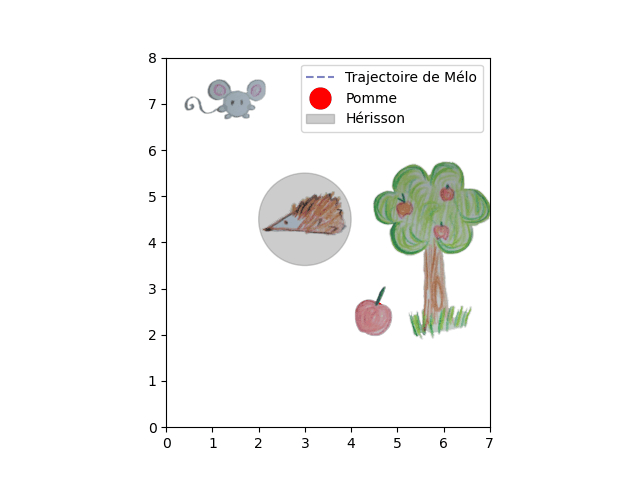

# Mélo et la commande optimale
*English version will come soon ...* 

**Description :** Ce dépôt contient le code utilisé dans une vidéo de vulgarisation scientifique dont l’objectif est d’expliquer, de manière simple et ludique, ce qu’est un **problème de commande optimale** (*Optimal Control Problem – OCP*) et comment il peut être résolu à l’aide de l’informatique.

<!--  -->


Dans cette vidéo, Mélo, une petite créature fictive, cherche à atteindre une pomme tout en respectant certaines contraintes (dynamique du mouvement, effort de commande, évitement d’obstacles). Ce problème est formalisé comme un problème de commande optimale, puis résolu numériquement.

Ce projet s’adresse à un public large : lycéens, étudiants, grand public curieux, ainsi qu’aux personnes ayant des bases en informatique ou en sciences.

>*Ce README est en cours de construction 🏗️ 
>Des explications plus détaillées, notamment à destination des débutants, seront ajoutées prochainement.
>Merci pour votre patience.* 

## Comment installer ? 
### Prérequis 
- Python 3.10
- Bibliothèques principales :
  - `gekko`
  - `numpy`
  - `matplotlib`

### Installer avec conda 
```
conda env create -n gekko310 -f environment.yml
conda activate gekko310
pip install gekko
```

## Licence

Ce code est mis à disposition à des fins éducatives et non commerciales.  
La réutilisation et la modification sont autorisées dans ce cadre, avec attribution.
